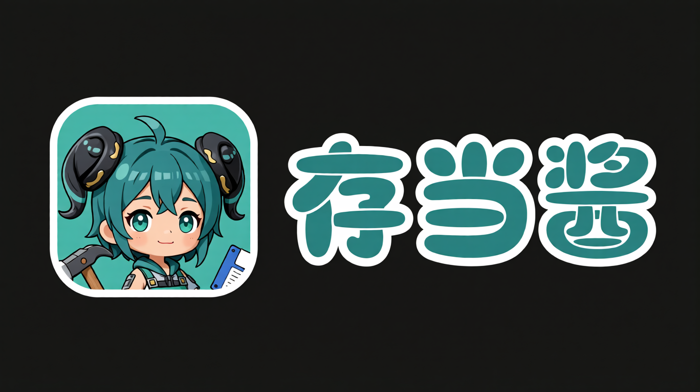
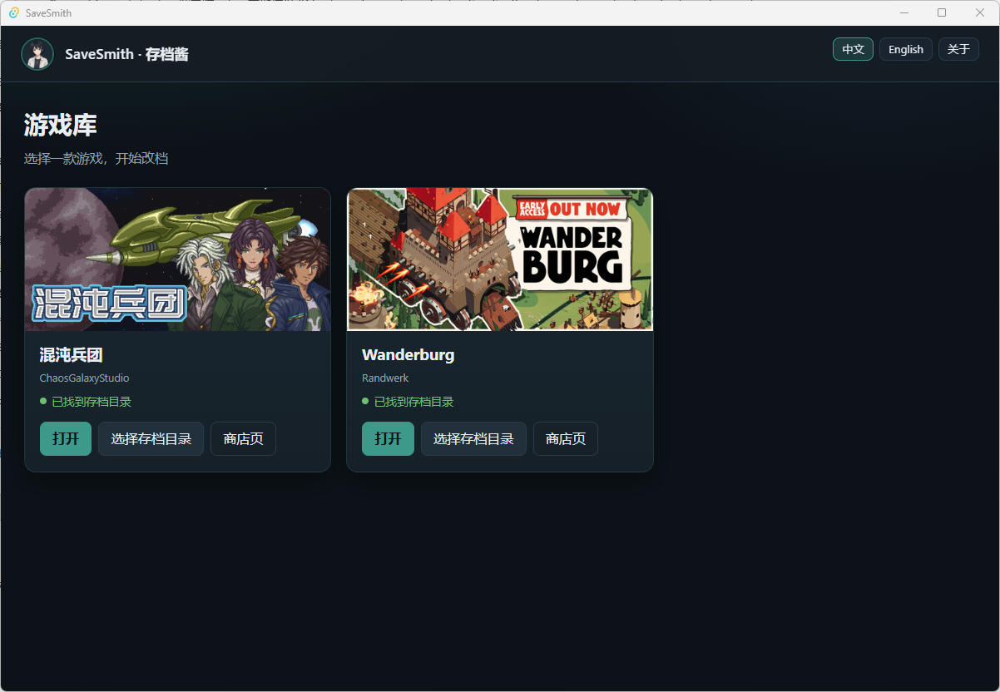

# SaveSmith · 存档酱

[中文](README.md) | **English**

<p align="center">
  
</p>

Open-source **single-player save editor** (Tauri 2 + Vue 3). It edits structured save files on disk — **not** a memory trainer. Games ship as compile-time modules; the list grows over releases.

> **Unofficial tool.** Not affiliated with, endorsed by, or associated with any game publisher. For personal, offline study by players who own a legitimate copy only. Do not use online, commercially, or to distribute modified saves.

## Screenshots

| Library | Chaos Front · Formation |
|:---:|:---:|
|  |  |

| Chaos Front · Units | Wanderburg · Unlock |
|:---:|:---:|
|  |  |

## Host features

- **Library**: compiled modules only; auto-detect save folder or pick one; header shows game, path, and slot
- **UI language**: Chinese / English; follows the system locale by default; **About** shows version and GitHub
- **Safe writes**: backup → temp file → atomic replace; last 10 backups per file with restore; invalid saves rejected; on Windows a failed overwrite does not delete the live file

Per-game editable fields, default paths, and caveats live in the docs linked below — keep them out of this README.

## Supported games

| Game | Rights holder | Status | Docs |
|------|---------------|--------|------|
| [Chaos Front](docs/games/chaos-front.en.md) | ChaosGalaxyStudio | Supported | [English](docs/games/chaos-front.en.md) · [中文](docs/games/chaos-front.md) |
| [Wanderburg](docs/games/wanderburg.en.md) | Randwerk | Supported (EA; format may change) | [English](docs/games/wanderburg.en.md) · [中文](docs/games/wanderburg.md) |

When adding a game: ship the module, add a row here, and write `docs/games/<id>.md` (+ `.en.md`).

## Download

Get the latest portable exe from [Releases](../../releases) (no installer):

- `SaveSmith-<version>-windows-x64.exe` — Windows x64 portable

Requires **Windows x64** and system **WebView2** (usually already on Windows 10 / 11). If WebView2 is missing, install the [Microsoft Edge WebView2 Runtime](https://developer.microsoft.com/microsoft-edge/webview2/) (Evergreen). Do not bundle a full Chromium.

## How to use

1. **Quit** the game completely (it may overwrite saves on exit)
2. Start SaveSmith → open the game in the library; use **Choose save folder** if needed
3. Load a slot → edit tabs → **Save**
4. Optionally **Restore** from the backup list (current file is backed up first)
5. Test against a **copy** of the save first

Default paths and game-specific details: see each game doc. Changelog: [CHANGELOG.en.md](CHANGELOG.en.md).

## Build from source

Requires Node.js 20+, npm, Rust (`cargo`), and MSVC build tools on Windows (win x64 target).

```bash
npm install
npm test
npm run typecheck
npm run tauri dev
npm run dist
```

`npm run dist` writes `src-tauri/target/release/savesmith.exe`. Optional installer: `npm run dist:installer`.

- Architecture: [docs/ARCHITECTURE.md](docs/ARCHITECTURE.md)
- Contributing: [CONTRIBUTING.md](CONTRIBUTING.md)
- Release: [docs/RELEASE.en.md](docs/RELEASE.en.md)
- Game-specific extraction notes: see that game’s doc (e.g. [Chaos Front](docs/games/chaos-front.en.md#developers-data-extraction))

## Disclaimer

1. **Unofficial**: Third-party fan tool — **not** developed, sponsored, endorsed, or affiliated with any game’s developer/publisher.
2. **Copyright**: Names, trademarks, characters, art, data, and text belong to the **respective rights holders**. Repo showcase assets are for **local reference by legitimate owners only**, do **not** include the games, and must not be used commercially.
3. **Allowed use**: Personal, local, **offline** study only. No multiplayer abuse, rental/sale, bundling, or other commercial/infringing use.
4. **Use at your own risk**: Editing may corrupt or break saves. Quit the game first and use backups. **By using this tool you accept all risk**; authors and contributors are not liable.
5. **Takedown**: Reasonable rights-holder requests may lead to modify/redact/take-down of the relevant module or releases.
6. **Support official games**: Buy through official channels. This tool does not replace a legal copy and does not encourage piracy.

## License

[MIT](LICENSE)
