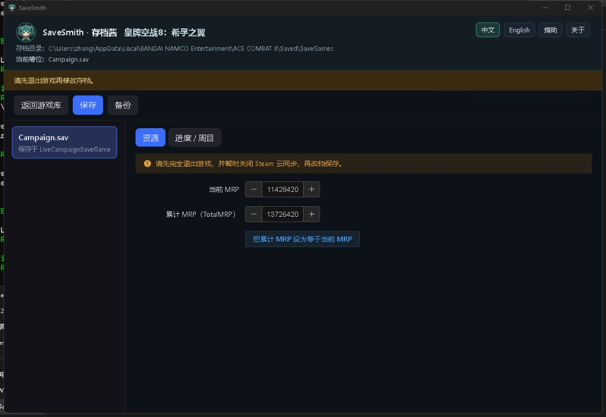
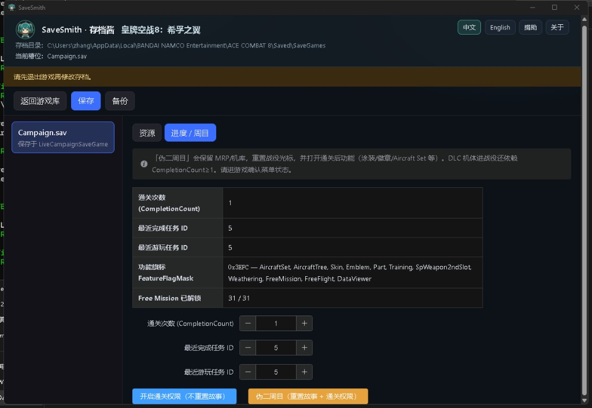

# 皇牌空战 8：希孚之翼 / ACE COMBAT 8

[**中文**](ace-combat-8.md) | [English](ace-combat-8.en.md)

非官方存档修改说明。权利人：**Bandai Namco Entertainment**（Steam AppID [2288340](https://store.steampowered.com/app/2288340/)）。与官方无关联。模块封面取自 Steam 商店头图，版权归 Bandai Namco。

深化路线（知识 → 轻量补齐 → 功能靠拢）：[设计](../design/2026-10-04-ace-combat-8-deepening-design.md) · [计划](../design/2026-10-04-ace-combat-8-deepening-plan.md)

## 存档位置

默认（Windows）：

`%LOCALAPPDATA%\BANDAI NAMCO Entertainment\ACE COMBAT 8\Saved\SaveGames`

识别文件：`Campaign.sav`（UE5 GVAS / `LiveCampaignSaveGame`）。本模块只编辑战役档，不改 `System.sav` / Online / Replay。

## 封条（Checksum）

外层 `Checksum`（`UInt32Property`）必须与 `PackedData` 载荷一致，否则游戏报「存档已损坏」。

游戏侧（自 `AceCombat8.exe` / 社区编辑器恢复）等价于：

```text
Checksum = FCrc::MemCrc32(PackedDataBytes, FCrc::StrCrc32(TEXT("XnMVqmFJnH!2")))
```

- 盐字符串：`XnMVqmFJnH!2`（UE `StrCrc32` 按 TCHAR 每字符 4 字节喂入）
- 得到的 CRC 初值即论坛常见的 **`0x41916EBD`**
- SaveSmith 实现：标准反射 CRC-32（多项式 `0xEDB88320`），初值 `~0x41916EBD`，终值再 `^ 0xFFFFFFFF`，输入为 PackedData **字节载荷**（不含外层 count 头）
- 变长字段（涂装 / 徽章 / 机体列表等）按参考编辑器方式整树重写 PackedData，再重算 Checksum；不要只改列表字节却不更新祖先 Size

## FeatureFlagMask（ELiveFeature）

| Bit | 名称 | 说明 |
|-----|------|------|
| 1 | AceDifficulty | Ace 难度（另见下方三件套） |
| 2 | AircraftSet | Aircraft Set |
| 3 | AircraftTree | 科技树菜单 |
| 4 | Skin | 涂装功能 |
| 5 | Emblem | 徽章功能 |
| 6 | Part | 零件 |
| 7 | Training | 训练 |
| 8 | MusicPlayer | 音乐播放器 |
| 9 | SpWeapon2ndSlot | 第二特殊武器槽 |
| 10 | Weathering | 旧化 |
| 11 | FreeMission | 自由任务 |
| 12 | FreeFlight | 自由飞行 |
| 13 | DataViewer | 数据检视 |

常见掩码：

- 中期进度示例：`0x38C8`（已有科技树等，无通关增量）
- 普通通关档：`0x3EFC`（通关增量 `0x634` = AircraftSet/Skin/Emblem/SpWeapon2ndSlot/Weathering）
- 更满的 100% 参考档：`0x3EFE`（在 `0x3EFC` 上再开 **AceDifficulty**）

### Ace 难度三件套

仅拨 `FeatureFlagMask` bit1 往往不够。参考实现同时做：

1. `FeatureFlagMask |= (1 << AceDifficulty)`
2. `UnlockData` 中 ID **`1800001`** 的 `bIsActivated = true`
3. `MenuMiscFlags` 加入 `ELiveMenuMiscFlagID::NewAceDifficulty`

## 可编辑内容（SaveSmith 现状）

| 标签 | 内容 |
|------|------|
| 资源 | 当前 MRP、累计 TotalMRP；可将累计同步为当前值 |
| 进度 / 周目 | 通关次数、最近完成 / 游玩任务 ID、功能旗标 / Free Mission / 机库情境 / 科技树节点摘要；一键开启通关权限或伪二周目 |
| 机体 | `OwnedAircrafts` 拥有开关；名称来自参考编辑器 assets 的 DataTable（无图标） |
| 涂装 | `UnlockedSkinIdList`；显示英文名称 |
| 徽章 | `UnlockedEmblemIdList`；显示英文名称 |
| 任务评级 | 31 关英文标题；仅改存档里已有记录的 HighestRank；可一键 S |

请勿手动把「最近完成 / 游玩任务 ID」改到 30/31，否则容易卡在末盘；卡住时用「伪二周目」把光标置 0。「开启通关权限」会合并 100% 参考列表（科技树 / 涂装 / 徽章 / 勋章）并激活 Ace UnlockData。

### 截图

| 资源 | 进度 / 周目 |
|:---:|:---:|
|  |  |

## 参考档差异摘要

下列计数来自本地分析快照（`src/games/ace-combat-8/data/reference-100pct-snapshot.json` 等），**不是**再分发第三方整档。Nexus 等来源的完整 `.sav` 不得提交进本仓库。

| 字段 | mid fixture | cleared fixture | 100% 参考（本地） |
|------|-------------|-----------------|-------------------|
| FeatureFlagMask | `0x38C8` | `0x3EFC` | `0x3EFE` |
| CompletionCount | 0 | 1 | 1 |
| LastCompleted / LastPlayed | 5 / 5 | 31 / 31 | 3 / 3 |
| UnlockedFreeMissionIDs | 5 | 31 | 31 |
| UnlockedHangarSituationIDs | 5 | 31 | 31 |
| UnlockedAircraftTreeNodeIDs | 54 | 90 | 97 |
| UnlockedSkinIdList | 5 | 525 | 882 |
| UnlockedEmblemIdList | 95 | 112 | 285 |
| UnlockedMedalIdList | 0 | 12 | 29 |
| OwnedAircrafts | 15 | 32 | 36 |

说明：100% 参考档把任务光标停在第 3 关，说明「全解锁」不必卡在 30/31。

## 能力矩阵（对照参考编辑器）

对照开源工具 [RivaTesu/ac8-save-editor](https://github.com/RivaTesu/ac8-save-editor)（MIT；图标资产另发布，SaveSmith 不捆绑）：

| 能力 | SaveSmith | 参考编辑器 | 计划 |
|------|-----------|------------|------|
| MRP / Checksum | 有 | 有 | — |
| FeatureFlag / FreeMission / Hangar / Tree merge | 部分（通关掩码 + 列表） | 有 | **A** 已对齐 100% 列表 |
| Ace 难度（Feature + UnlockData） | 有（A） | 有（另可写 MenuMiscFlag） | 100% 参考档无 NewAceDifficulty 旗，SaveSmith 与之对齐 |
| OwnedAircrafts / Skins / Emblems | 有（按 ID；无图标名） | 有（含 assets 名/图） | **B** 已接入独立页 |
| Medals / Parts | 无独立页 | 有 | 勋章随通关 merge；零件仍不做 |
| CompletedMissionList 评级 | 有（仅已有记录；可一键 S） | 有 | **B** |
| System.sav | 无 | 有 | B 可选 |
| UnlockData 全表 | 无 | 有 | A 最小（Ace）+ B 扩展 |
| Advanced 属性树 | 无 | 有 | **不做** |

## 使用注意

1. 修改前**完全退出游戏**，并暂时**关闭 Steam 云同步**（云端可能覆写本地改档）。
2. 首次请用存档**副本**试验；保存前会自动备份（每文件最近 10 份）。
3. 伪二周目会保留机库与 MRP，把任务光标重置为 0，并打开通关后功能；DLC 机体进战役仍依赖 `CompletionCount ≥ 1`。
4. 请勿用于联机或传播已修改存档。
5. 启动画面正中出现 `RTCoreMini64.sys` 等驱动名：Easy Anti-Cheat 在拦监控软件，不是存档损坏。先退出 RivaTuner / MSI Afterburner。

## 开发者

- 模块代码：`src/games/ace-combat-8/`
- 字段快照脚本：`node scripts/ac8-snapshot-save.mjs <Campaign.sav> [out.json]`
- 名称表提取：`node scripts/ac8-extract-catalog.mjs <ac8-save-editor/assets>`（写入 `src/games/ace-combat-8/data/catalog.json`；不复制 PNG）
- 设计：[2026-10-02](../design/2026-10-02-ace-combat-8-design.md) · [深化 2026-10-04](../design/2026-10-04-ace-combat-8-deepening-design.md)

返回 [README](../../README.md)。
