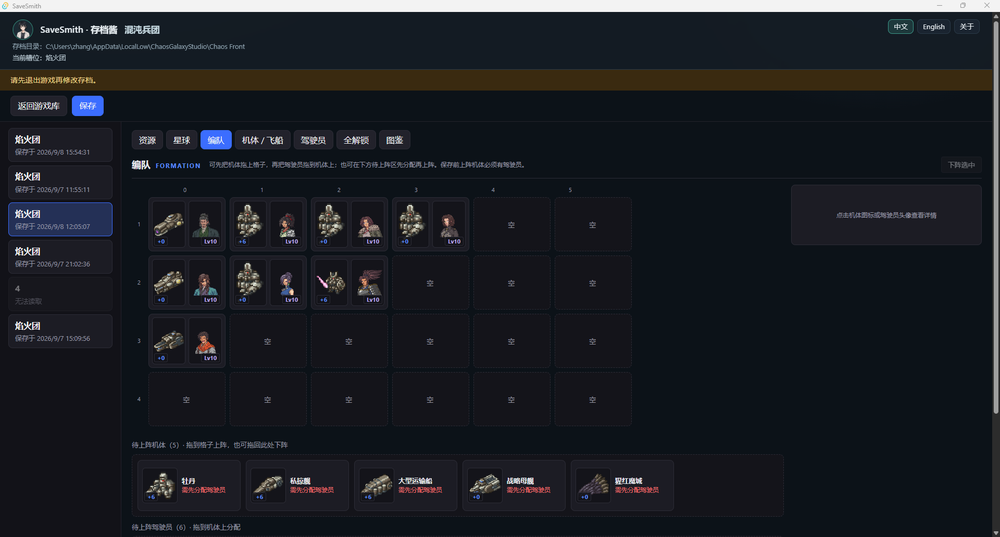
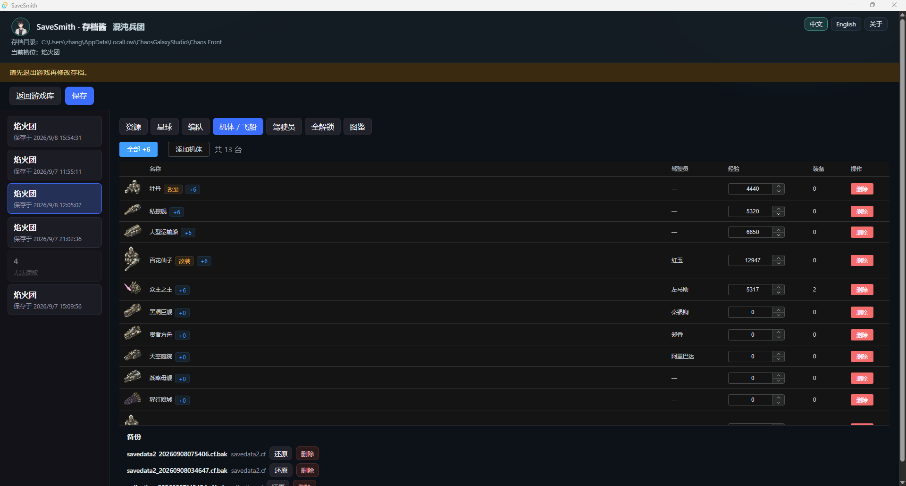

# 混沌兵团（Chaos Front）

[**中文**](chaos-front.md) | [English](chaos-front.en.md)

非官方存档修改说明。权利人：**ChaosGalaxyStudio**（Steam AppID [2770330](https://store.steampowered.com/app/2770330/)）。与官方无关联。

## 存档位置

默认（Windows）：

`%USERPROFILE%\AppData\LocalLow\ChaosGalaxyStudio\Chaos Front`

识别文件示例：`savedata0.cf` … `savedata5.cf`、`collection.cf`。

## 可编辑内容

| 标签 | 内容 |
|------|------|
| 资源 | 委员会历（年/月/日）、信用点、威望、星级、勋章与势力关系 |
| 星球 | 经济 / 工业 / 防御 / 稳定与所属势力 |
| 编队 | 4×6 网格上阵 / 下阵 / 换位，分配驾驶员 |
| 机体 / 飞船 | 等级、经验、装备；添加 / 删除 |
| 驾驶员 | 等级、经验等 |
| 全解锁 | 解锁机型与装备 |
| 图鉴 | 点亮结局与收藏（`collection.cf`） |

槽位：最多 6 个（显示军团名、保存时间）。保存前自动备份（每文件最近 10 份），可在备份面板还原。

## 截图





## 使用注意

1. 修改前**完全退出游戏**（退出时可能覆写存档）。
2. 首次请用存档**副本**试验。
3. 写盘遵循宿主统一策略：备份 → 临时文件 → 原子替换；解析失败拒绝写入。

## 开发者：素材提取

机体列表、等级表、名称与图标等由脚本从游戏文件生成（产物：`src/games/chaos-front/data/game-data.json`、`src/games/chaos-front/assets/game/`）。

**需要自备**：游戏本体（含 `Chaos Front_Data`）与 [AssetRipper](https://github.com/AssetRipper/AssetRipper)（GUI 免费版即可）。

```bash
node scripts/extract-game-data.mjs --game "游戏目录\Chaos Front_Data" --ripper "C:\tools\AssetRipper.GUI.Free.exe" --out .
```

- `--game`（必填）：`Chaos Front_Data` 目录
- `--ripper`：AssetRipper 可执行文件；省略时仅提取数据表
- `--out`：仓库根，默认当前目录
- `--export <dir>`：复用已有 AssetRipper 导出目录

返回 [README](../../README.md)。
