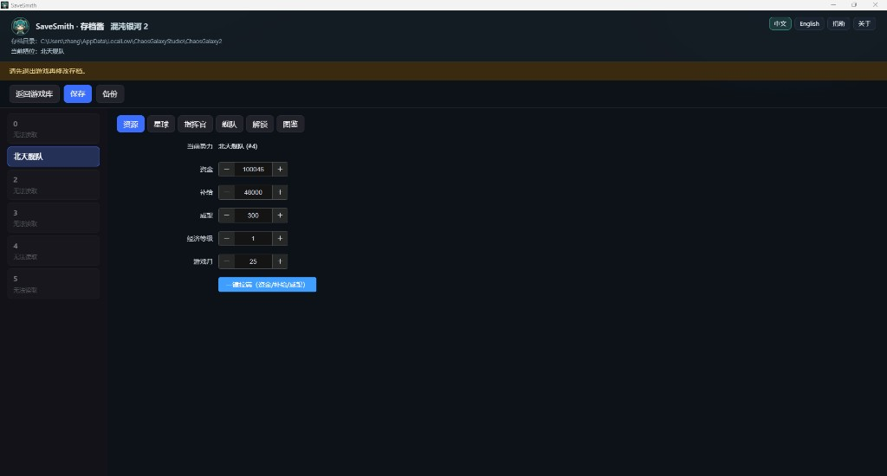
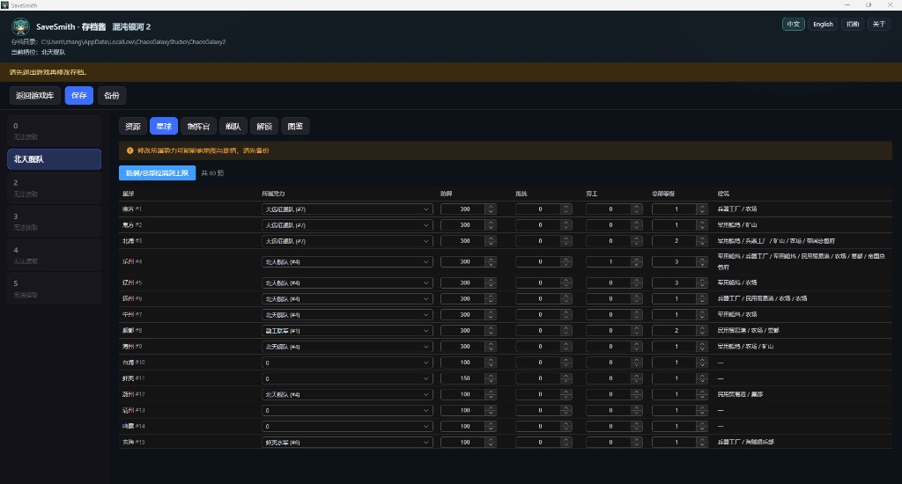
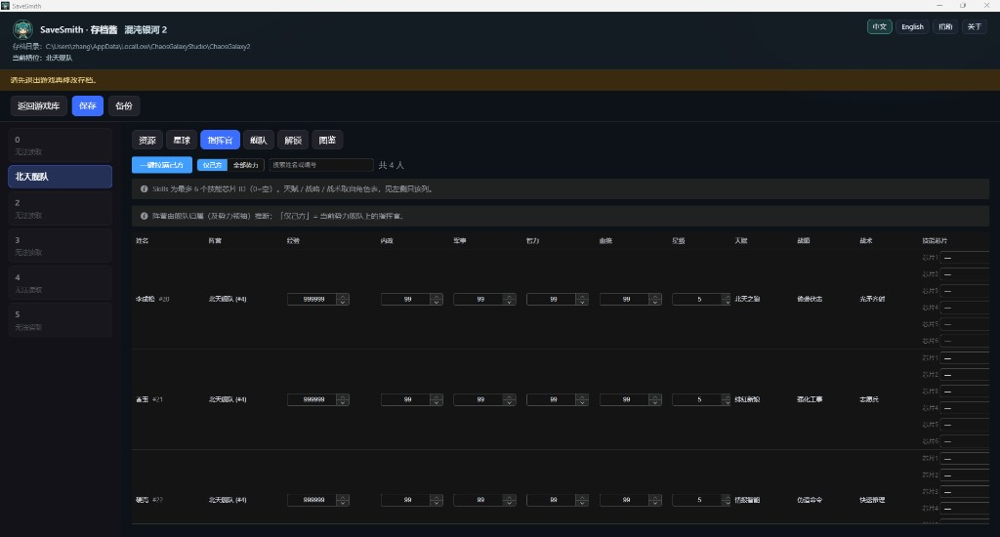
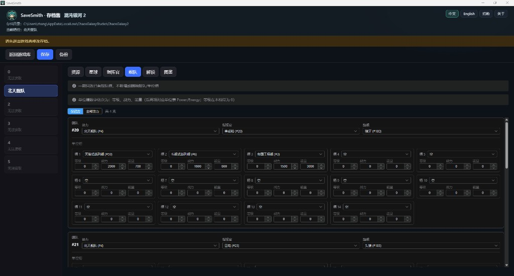
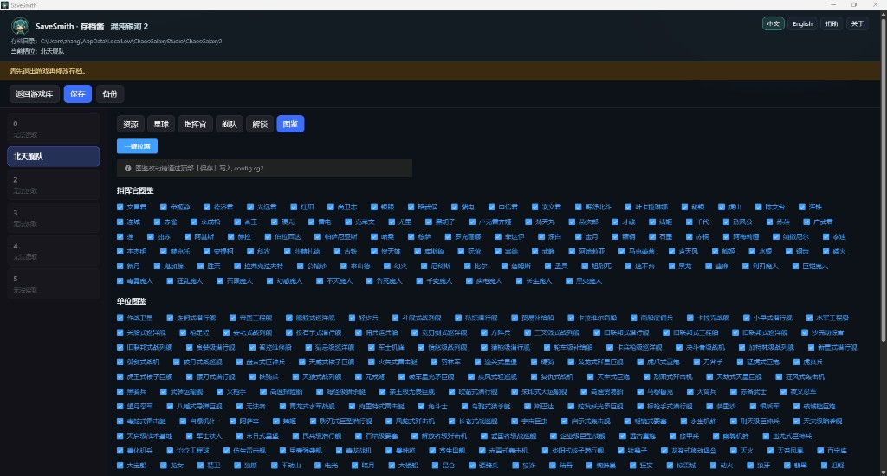

# 混沌银河 2（Chaos Galaxy 2）

[**中文**](chaos-galaxy-2.md) | [English](chaos-galaxy-2.en.md)

非官方存档修改说明。权利人：**ChaosGalaxyStudio**（开发者 Han Zhiyu；Steam AppID [1537910](https://store.steampowered.com/app/1537910/)）。与官方无关联。

存档为 Easy Save 3 **二进制**（`.cg2`），与《混沌兵团》的 ES3 JSON 不同。

## 存档位置

默认（Windows）：

`%USERPROFILE%\AppData\LocalLow\ChaosGalaxyStudio\ChaosGalaxy2`

识别文件示例：`savedata0.cg2` … `savedata5.cg2`、`config.cg2`。

## 可编辑内容

| 标签 | 内容 |
|------|------|
| 资源 | 己方势力资金 / 补给 / 威望、经济等级、游戏月 |
| 星球 | 所属势力（名称下拉）、防御、抵抗、劳工、总部等级（建筑阵列一期只读） |
| 指挥官 | 经验、内政 / 军事 / 智力 / 血统、星级；**技能芯片**（名称下拉）；天赋 / 战略 / 战术只读。默认仅己方、可搜索；一键拉满己方。**不增删** |
| 舰队 | 卡片式编辑：势力 / 指挥官 / 旗舰 + 单位槽网格（等级 / 战力 / 能量）。默认仅己方。**一期不增删舰队/单位槽** |
| 解锁 | 当前势力 `*Unlocked`（如「外星内容解锁」）；一键解锁已知项 |
| 图鉴 | 点亮指挥官 / 单位 / 事件收藏（`config.cg2` bitmask） |

槽位：最多 6 个（显示玩家名）。`config.cg2` 中的音量、分辨率、语言等设置**不改**。保存前自动备份（每文件最近 10 份），可在备份面板还原。

## 截图











## 使用注意

1. 修改前**完全退出游戏**（退出时可能覆写存档）。
2. 首次请用存档**副本**试验。
3. 写盘遵循宿主统一策略：备份 → 临时文件 → 原子替换；解析失败拒绝写入。
4. 不保证 Steam Cloud / 未退游戏时的写档安全。

## 开发者：素材提取

指挥官、单位、星球、建筑名称与上限等由脚本从游戏文件生成（产物：`src/games/chaos-galaxy-2/data/game-data.json`、`src/games/chaos-galaxy-2/assets/game/`）。游戏本体无独立指挥官等级表时，经验/资源上限使用脚本内保守回落常量。

**需要自备**：游戏本体（含 `ChaosGalaxy2_Data`）。图标需 [AssetRipper](https://github.com/AssetRipper/AssetRipper)（GUI 免费版即可）；仅更新数据表可省略。

```bash
node scripts/extract-chaos-galaxy-2.mjs --game "游戏目录\ChaosGalaxy2_Data" --ripper "C:\tools\AssetRipper.GUI.Free.exe" --out .
```

- `--game`（必填）：`ChaosGalaxy2_Data` 目录
- `--ripper`：AssetRipper 可执行文件；省略时仅提取数据表（`--json-only`）
- `--out`：仓库根，默认当前目录
- `--export <dir>`：复用已有 AssetRipper 导出目录

返回 [README](../../README.md)。
