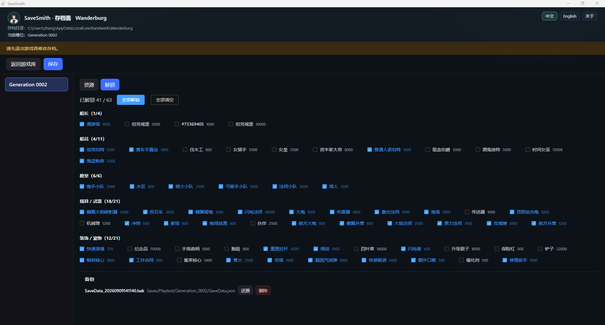

# Wanderburg

[**中文**](wanderburg.md) | [English](wanderburg.en.md)

非官方存档修改说明。权利人：**Randwerk** / Sidekick Publishing（Steam AppID [3624140](https://store.steampowered.com/app/3624140/)）。与官方无关联。

> Early Access：存档格式可能变更；改档能力以当前密钥与往返测试通过为前提。

## 存档位置

默认（Windows）：

`%USERPROFILE%\AppData\LocalLow\Randwerk\Wanderburg`

槽位路径形态：`Saves/Playtest/Generation_*/SaveData.json`。

存档为 `SaveLoad.StringCipher` 加密 JSON。

## 可编辑内容

| 标签 | 内容 |
|------|------|
| 资源 | 如 `silver`、`silverBeforeLastRun` 等 |
| 解锁 | `unlockedIDs` 勾选（船长 / 船员 / 舱室 / 载具武器 / 装饰宠物等分类） |

保存前自动备份（每文件最近 10 份），可在备份面板还原。

## 截图

## 使用注意

1. 修改前**完全退出游戏**。
2. 首次请用存档**副本**试验。
3. EA 更新后若无法加载或写回，以当前版本发行说明为准，可能需要等待模块适配。

返回 [README](../../README.md)。
